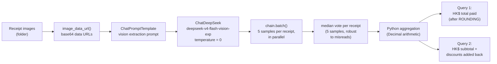

# FTEC5660 Homework 1: Receipt Chain

Build a LangChain pipeline that reads every supermarket receipt in a folder
with the vision-capable DeepSeek Flash model and answers these two questions:

1. How much money did I spend in total for these bills?
2. How much would I have had to pay without the discount?

For this homework, **amount spent** means the final payment after the receipt's
rounding line. **Without the discount** means the sum of the original positive
item prices: add back every promotion, coupon, member, app, packaging-damage,
and percentage discount, but do not add back rounding.

## Student task

Only edit the two functions in `hw1.py` that contain `### YOUR CODE HERE`:

- `build_chain()` creates your LangChain chain.
- `answer_queries()` runs the chain on the receipt images and returns one final
  response for each question.

You may use prompt chaining, routing, parallel calls, reflection, or a
combination. Your final responses should each contain one HKD amount. Do not
hard-code filenames or public answers; grading uses unseen receipt folders.

## Setup and public test

```bash
python3 -m venv .venv
source .venv/bin/activate
pip install -r requirements.txt
```

Put your DeepSeek key after `DEEPSEEK_API_KEY=` in `.env`, then run:

```bash
python3 hw1.py --image-folder public_test
```

The program creates `results.csv` in the current directory. Its columns are
`query`, `model_response`, and `correctness`. The public answers are in
`public_test/ground_truth.json`. The starter intentionally returns the dummy
response `please design your chain to answer these two queries.` so it runs
before you add any API code.

The required model is `deepseek-v4-flash-vision-exp`, the vision-capable
DeepSeek Flash model. JPEG, PNG, GIF, and WebP inputs are accepted by the
homework runner.


## Homework 1 solution

### Chain design



### Solution description

My chain has two stages. First, a LangChain `RunnableSequence` (`ChatPromptTemplate | ChatDeepSeek`) reads each receipt image independently and extracts exactly three fields as strict JSON: `final_payment` (the amount actually paid, after the ROUNDING line), `subtotal` (the SUBTOTAL line), and `discounts` (every discount / promotion / coupon line as positive numbers, excluding ROUNDING). The prompt instructs the vision model (`deepseek-v4-flash-vision-exp`) to read every amount digit by digit, double-check against the image, and output only the JSON object, so the model does pure extraction and no arithmetic. Second, `answer_queries` runs the extraction five times per receipt in parallel with `chain.batch` and takes the median of the five samples for each receipt, so occasional misread digits or a skipped discount line cannot swing the total — this keeps results stable across repeated runs. The numbers are then combined deterministically in Python with `Decimal`: Query 1 sums `final_payment` across receipts, Query 2 sums `subtotal + discounts` (discounts added back as positive values, never rounding). Each answer is formatted as a single HKD amount (e.g. `HK$1974.30`) so the response contains exactly one number. The model runs at temperature 0 for stable, repeatable results across runs. Tested end-to-end on `public_test` (7 receipts): both queries match `ground_truth.json`.

